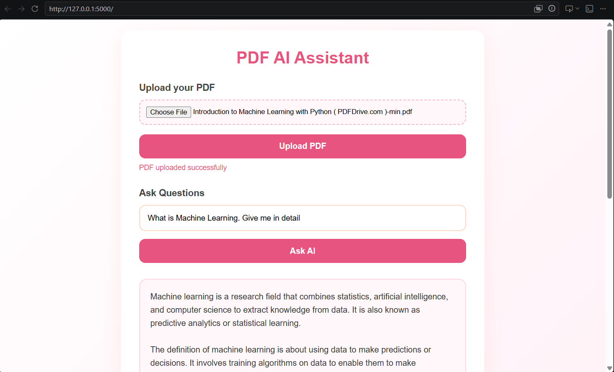

# PDF AI Assistant — My First RAG Project

## Overview

This is my first **Retrieval-Augmented Generation (RAG)** project built using Python and modern AI tools.

The application allows users to upload a PDF document and ask questions based on its content. The system retrieves the most relevant information from the uploaded document and generates intelligent answers using a Large Language Model (LLM).

This project helped me understand how modern AI systems combine:

* Document Retrieval
* Embeddings
* Vector Search
* Large Language Models (LLMs)

to build real-world AI applications.

---

# Features

Users can:

* Upload PDF documents
* Ask questions related to the uploaded PDF
* Get AI-generated answers based only on document content
* Perform semantic search using vector embeddings
* Interact with a simple and clean web interface

---

# Example

### Input

**Uploaded PDF:** Computer Organization Notes

**Question:**

> What is an instruction cycle?

### Output

AI-generated explanation retrieved from the uploaded document.

---

# Project Screenshot

Add your project screenshot here.

```md

```

# Screenshots

<p align="center">
  
</p>


---

# Technologies Used

## Backend

* Python
* Flask

## AI / RAG Components

* Sentence Transformers
* all-MiniLM-L6-v2 (Embeddings Model)
* FAISS (Vector Database / Similarity Search)
* Groq API
* Llama 3.3 70B Versatile

## Document Processing

* PyPDF

## Frontend

* HTML
* CSS
* JavaScript

---

# How It Works

## Step 1 — PDF Upload

The user uploads a PDF document through the web interface.

## Step 2 — Text Extraction

The application extracts text from the PDF using PyPDF.

## Step 3 — Text Chunking

The extracted text is split into smaller chunks for better retrieval performance.

## Step 4 — Embedding Generation

Each chunk is converted into vector embeddings using:

```python
all-MiniLM-L6-v2
```

## Step 5 — Vector Storage

The embeddings are stored in FAISS for efficient semantic search.

## Step 6 — Retrieval

When the user asks a question:

* The query is converted into embeddings
* FAISS retrieves the most relevant chunks

## Step 7 — Answer Generation

The retrieved chunks are sent to the Groq LLM, which generates the final answer.

---

# What I Learned

Through this project, I learned:

* What RAG architecture is
* How embeddings work
* How vector databases work
* Semantic search
* Prompt engineering
* Building AI applications using Flask
* Integrating LLM APIs into real-world projects
* End-to-end AI application development

---

# Future Improvements

I plan to add:

* Multiple PDF upload support
* Chat history
* Better chunking strategies
* Support for DOCX and TXT files
* User authentication
* Cloud deployment
* Streaming AI responses
* Better UI/UX

---

# Project Structure

```bash
project/
│
├── app.py
├── uploads/
├── templates/
│   └── index.html
├── static/
├── requirements.txt
└── README.md
```

---

# Installation


## Create Virtual Environment

```bash
python -m venv venv
```

## Activate Virtual Environment

### Windows

```bash
venv\Scripts\activate
```

### Mac/Linux

```bash
source venv/bin/activate
```

## Install Dependencies

```bash
pip install -r requirements.txt
```

---

# Run the Application

```bash
python app.py
```

Open in browser:

```bash
http://127.0.0.1:5000
```

---

# Environment Variables

Create a `.env` file and add:

```env
GROQ_API_KEY=your_api_key_here
```

---

# Requirements

Example `requirements.txt`

```txt
flask
numpy
faiss-cpu
pypdf
sentence-transformers
groq
python-dotenv
```

---

# Why I Built This

As this is my first RAG project, I wanted to understand how AI assistants work behind the scenes and gain hands-on experience building an end-to-end AI application.

This project gave me practical exposure to:

* Retrieval-Augmented Generation
* LLM integration
* Embeddings
* Semantic search
* AI application architecture

---

# Author

Siva Kumar

---

# License

This project is open-source and available under the MIT License.
